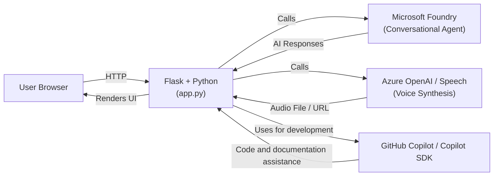

# Audilora

> Attribution
> This project is based on the Microsoft Computer History Client sample, licensed under the MIT License.
> Modified and extended for this project.

Audilora is an AI-powered platform that helps students decode spoken English as it is used by native speakers. Unlike traditional courses, apps, and language institutes that focus primarily on vocabulary and grammar, this solution addresses one of the biggest challenges in language learning: understanding natural speech.

The system generates content based on thematic scenarios and converts it into audio. It also provides a pronunciation abstraction adapted for Spanish speakers and explanations of linguistic phenomena such as linking (connecting words), blending (merging sounds), assimilation (sound changes), and reductions (shortened word forms).

## Problem It Solves

Many students can read English but struggle to understand everyday conversations because pronunciation often differs significantly from written language. Unlike Spanish, English has a deep orthography, where the same letter combinations or vowels may produce different sounds depending on context.

Although tools such as the International Phonetic Alphabet (IPA) can represent these sounds accurately, learning IPA may be difficult for beginners. Audilora reduces this barrier by helping learners identify sounds that do not exist in Spanish and are often difficult to perceive. As users progress, they can gradually become familiar with IPA and improve their ability to recognize spoken English.

## Key Features

* 🎧 Convert and play text as natural-sounding audio.
* 🔤 Pronunciation guidance designed for Spanish speakers.
* 🎨 Visual highlighting of pronunciation techniques using colors.
* 🤖 AI agent that explains why words sound the way they do.

## Technologies Used

* Flask (web server)
* Python (backend)
* Microsoft Foundry (agent orchestration and knowledge management)
* Azure OpenAI (voice service)
* GitHub and GitHub Copilot (development and collaboration)

## Impact

Audilora accelerates English learning by exposing students to real spoken language from the beginning. Instead of focusing only on rules or isolated words, it creates an intuitive connection between written and spoken English.

As a result, listening comprehension improves significantly and supports shadowing practice, allowing learners to imitate pronunciation, intonation, rhythm, and fluency more accurately.

Learning a language is not about memorizing—it is about recognizing patterns, listening, repeating, and automating.

## Video

https://youtu.be/_TAqvGeKT-0

## Architecture

Audilora uses Microsoft Foundry as the core engine behind the conversational agent. The Flask backend sends prompts to the agent and receives structured responses that are later displayed in the UI. Voice synthesis is handled through Azure OpenAI / Speech, generating audio from the produced text.

During development, GitHub Copilot was used to accelerate implementation, refactor code, and document workflows.

## Members

* [mvalenzuelapenagos@gmail.com](mailto:mvalenzuelapenagos@gmail.com)
