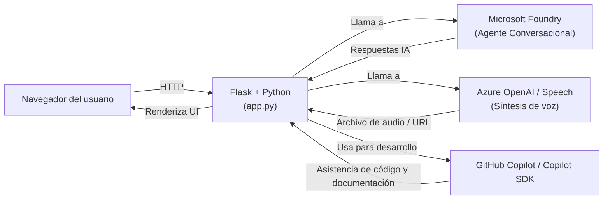

# Audilora

> Attribution
This project is based on the Microsoft Computer History Client sample, licensed under the MIT License.
Modified and extended for this project.

Audilora es una plataforma impulsada por IA que ayuda a los estudiantes a decodificar el inglés hablado por nativos. A diferencia de cursos, aplicaciones e institutos  tradicionales enfocados en vocabulario y gramática, esta solución aborda uno de los mayores desafíos del aprendizaje del inglés: interpretar el habla natural. 
El sistema genera contenido basado en escenarios temáticos y lo convierte en audio. Además proporciona una abstracción de la pronunciación adaptada para hispanohablantes y explicaciones sobre fenómenos lingüísticos, como linking (unión de palabras), blending (mezclar sonidos), assimilation (cambiar sonidos) y reductions (acortar palabras).

## Problema que resuelve

Muchos estudiantes pueden leer inglés, pero tienen dificultades para entender conversaciones cotidianas, ya que la pronunciación suele diferir significativamente de la escritura. A diferencia del español, el inglés posee una ortografía profunda, donde una misma combinación de letras o vocales puede producir distintos sonidos según el contexto. 
Aunque herramientas como el Alfabeto Fonético Internacional (IPA) permiten representar estos sonidos con precisión, su aprendizaje puede resultar complejo para quienes están comenzando. Audilora reduce esta barrera al facilitar la identificación de sonidos que no existen en español y que suelen ser difíciles de percibir para los estudiantes. A medida que avanzan en su aprendizaje, los usuarios pueden familiarizarse progresivamente con la IPA y desarrollar una mejor capacidad para reconocer el inglés hablado.

## Funcionalidades principales

- 🎧 Conversión y reproducción de textos a audios auténticos.
- 🔤 Pronunciación orientada para hispanohablantes.
- 🎨 Resaltado visual de técnicas de pronunciación mediante colores.
- 🤖 Agente de IA que explica por qué las palabras suenan de determinada manera.

## Tecnologías utilizadas

- Flask (servidor web)
- Python (backend)
- Microsoft Foundry (agente y gestión de conocimiento)
- Azure OpenAI (servicio de voz)
- GitHub y GitHub Copilot (desarrollo y colaboración)

## Impacto

Acelera el aprendizaje del inglés al exponer a los estudiantes al habla real desde el inicio. En lugar de centrarse en reglas o palabras aisladas, crean una conexión intuitiva entre escritura y sonido. 
Como resultado, mejora significativamente la comprensión auditiva y se fortalece la práctica de shadowing, permitiendo imitar con mayor exactitud la pronunciación, la entonación, el ritmo y la fluidez de los hablantes nativos.
Aprender un idioma no es memorizarlo: es reconocer patrones, escuchar, repetir y automatizar. 


## Video

https://youtu.be/_TAqvGeKT-0

## Arquitectura 



Audilora usa Microsoft Foundry como motor principal del agente conversacional. El backend de Flask envía prompts al agente y recibe respuestas estructuradas que luego se muestran en la UI. La síntesis de voz se realiza con Azure OpenAI / Speech, generando audio a partir del texto producido.

Durante el desarrollo se empleó GitHub Copilot para acelerar la implementación, refactorizar el código y documentar flujos. 

# Inicio rápido

## Instalación

```bash
cd my-agent
python -m venv .venv
.venv\Scripts\activate  # Windows
pip install -r british-teacher-client/requirements.txt
```

## Configuración

Crea un archivo `.env` dentro de `british-teacher-client/` con tus credenciales de Azure.

```env
AGENT_ENDPOINT=https://tu-endpoint-del-agente-de-azure-foundry/v1/responses
AZURE_SPEECH_KEY=tu_clave_de_speech_aqui
AZURE_SPEECH_REGION=tu_region_de_speech_aqui
```

* Reemplaza `tu-endpoint-del-agente-de-azure-foundry` con el endpoint de tu agente de Microsoft Foundry.
* Obtén la clave (*Speech Key*) y la región desde el servicio Azure Speech.

## Ejecutar

Haz clic derecho sobre `british-teacher-client/agent_client.py` y selecciona **"Abrir en Terminal Integrada"**.

```bash
cd british-teacher-client
python app.py
```

Abre en el navegador:

```text
http://127.0.0.1:5000
```

## Miembros

- mvalenzuelapenagos@gmail.com
